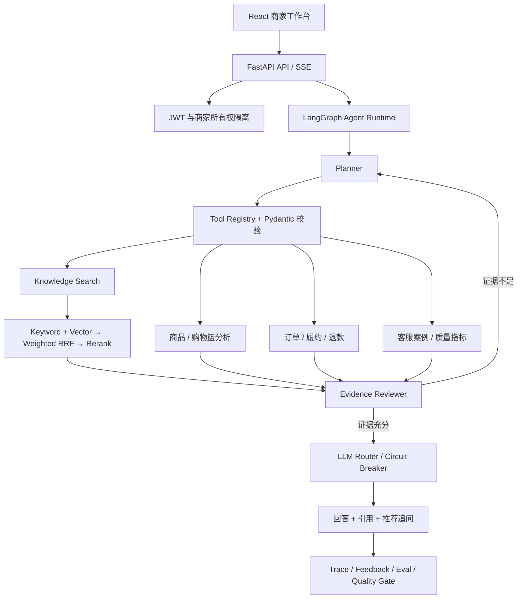

<h1 align="center">邻里鲜选 AI 运营台</h1>

<p align="center">
  <strong>面向即时零售商家的 Agentic RAG 客服与经营决策平台</strong><br/>
  让 AI 自主判断是否检索知识、查询订单或分析经营数据，并把每条结论追溯到证据。
</p>

<p align="center">
  
  
  
  
  
  
</p>

<p align="center">
  
</p>

## 🚀 这是什么项目？

邻里鲜选不是一个只会回答问题的“知识库聊天框”，而是一套围绕即时零售真实工作流构建的 AI 应用工程项目：

- 顾客咨询退货、履约、促销或食品安全时，Agent 自主选择知识、订单、履约、退款与客服工具。
- 商家询问商品搭配、缺货风险或经营机会时，系统查询隔离后的交易事实并给出可复核依据。
- 回答生成前由 Evidence Reviewer 检查相关性、覆盖度、冲突和高风险缺口，证据不足时受限重规划。
- 每次运行记录计划、工具参数、证据、耗时和终止状态，可进入评测、优化任务和发布门禁。

项目的完整闭环是：

```text
真实/公开数据 → 知识与经营事实 → Agent 自主规划 → 可追溯回答
       ↑                                      ↓
  知识发布 ← 缺口与优化任务 ← 反馈 / Trace / Eval
```

> 本项目以 [nageoffer/ragent](https://github.com/nageoffer/ragent) 为学习与改造起点，重构为 Python / FastAPI 后端，并扩展了即时零售数据、LangGraph Agent、证据审查、客服质量闭环和商家运营工作台。上游项目与本项目的技术实现、业务范围并不相同。

## 🧭 快速导航

| &nbsp; | 入口 | 说明 |
|:---:|:---|:---|
| ⚡ | [快速开始](#quick-start) | 初始化环境、导入演示数据并启动 |
| 🏗️ | [核心设计](#architecture) | Agent、RAG、模型路由和业务工具架构 |
| ✨ | [项目能力](#features) | 已落地的产品与工程能力 |
| 📊 | [数据与可信度](#data) | 数据来源、口径和 provenance |
| 🧪 | [测试与验证](#quality) | 一键验证与覆盖范围 |
| ⚙️ | [配置与部署](#deployment) | 模型、向量库和服务器部署 |
| 📚 | [设计文档](#documents) | 架构、可靠性和演进记录 |

## 💡 为什么要做它？

很多 RAG 项目的链路只有 `Embedding → TopK → LLM`，可以演示，却难以回答真实业务中的几个问题：

1. 用户问的是规则、订单还是经营分析，系统应该查什么？
2. 搜到内容是否真的足够支撑结论，证据冲突怎么办？
3. 模型超时、空回答或供应商故障时，系统如何降级？
4. AI 回答效果如何评测，问题如何回流到知识和产品迭代？
5. 演示数据、衍生指标和真实观测数据如何避免混为一谈？

邻里鲜选把这些问题落到了代码和产品界面里。它更适合作为 **AI Application Engineer / Agent Engineer / RAG Engineer / AI 产品运营** 方向的工程作品，而不是一个框架套壳 Demo。

<a id="architecture"></a>

## 🏗️ 核心设计

### 系统架构



### Agentic RAG 主链路

```text
Question
   ↓
Planner ── 决定是否调用工具、调用哪个工具
   ↓
Tools ──── knowledge / commerce / order / support
   ↓
Evidence Reviewer ── relevance / coverage / contradiction / authority
   ├─ insufficient → 带观察结果重新规划（有步数与调用预算）
   └─ ready        → 组织可引用上下文
   ↓
Model Router ── 主模型 / 备用模型 / 超时 / 熔断 / 空回答降级
   ↓
SSE Answer ── thinking / response / sources / finish
```

<details>
<summary><b>为什么同时使用 LangGraph 与自研业务模块？</b></summary>

LangGraph 负责有状态编排：`Planner → Tools → Reviewer → Re-plan`。检索、模型路由、熔断、会话一致性、数据权限和业务 SQL 仍由项目自己的模块实现。

这种边界避免把所有逻辑堆进一个 Agent Prompt，也避免为了“用了框架”而牺牲可测试性。Planner 不可用时存在确定性 fallback；工具参数由 Pydantic 校验；运行受 `max_steps` 和 `max_tool_calls` 约束，不允许无限循环。

</details>

<details>
<summary><b>混合检索为什么不是简单向量 TopK？</b></summary>

知识检索并发执行关键词与向量通道，使用数据库 Chunk ID 去重，再通过 Weighted RRF 融合不同分值空间。融合结果可以进入 CrossEncoder 重排；重排不可用时保留融合排序，不让整个问答失败。

```text
Keyword ─┐
         ├─ Dedup → Weighted RRF → Optional Rerank → Metadata Enrichment
Vector  ─┘
```

指定知识库时，关键词和向量通道使用同一 Scope；任何单通道异常都不会拖垮完整请求。

</details>

<details>
<summary><b>模型调用如何处理生产故障？</b></summary>

- 多供应商按优先级路由，主模型失败后切换备用模型。
- 区分总超时、首 Token 超时和 Token 间空闲超时。
- 三态熔断器隔离持续故障的供应商，并在恢复窗口后试探。
- 客户端取消会传播到生成任务，避免后台继续消耗模型额度。
- 空回答、异常流和失败消息都有明确状态，不伪装为成功结果。

</details>

<a id="features"></a>

## ✨ 项目能力

### 1. Agent 与可追溯问答

- LangGraph ReAct 查询规划与工具自主路由。
- 知识、交易、订单、履约、退款、顾客快照和客服案例工具。
- Evidence Reviewer 检查证据相关性、覆盖度、冲突、权威性和高风险字段。
- SSE 流式思考、正文、来源与结束事件；刷新后可恢复完整状态。
- 来源区分知识文档、内部经营数据、观测数据、衍生指标和演示数据。
- 点赞、点踩、重新生成、推荐追问与对话版本持久化。

### 2. 知识与检索工程

- 多知识库和商家所有权隔离。
- TXT、Markdown、PDF、DOCX 上传、解析、分块和预览。
- 关键词 + Milvus 向量混合检索、Weighted RRF、可选 Rerank。
- 已发布知识版本、候选版本、知识缺口和上线前评测。
- 本地 `BGE-small-zh-v1.5` Embedding，输出 512 维向量。

### 3. 即时零售运营

- 购物篮支持度、置信度、提升度与共现次数计算。
- 关联规则筛选、排序、证据下钻和搭配购方案创建。
- 商品、订单、履约、退款和顾客历史上下文。
- AI 工具渗透率、回答好评率、知识命中率和高频意图分析。
- 运营问题转化为优化任务、周报与可审计动作。

### 4. 客服质量闭环

- 工单队列、会话区、订单上下文和 AI Copilot 三栏工作台。
- AI 只生成建议草稿；人工确认后才能模拟或真实外发。
- 负反馈、知识未命中、慢响应和失败运行聚合为知识缺口。
- 固定评测集覆盖 retrieval、reasoning、refusal、multi-tool 与高风险场景。
- 高风险用例失败会阻止候选知识版本上线。

### 5. 工程可靠性

| 能力 | 实现 |
|:---|:---|
| 请求一致性 | requestId 指纹、处理中拒绝重复、成功结果回放、失败可安全重试 |
| 会话一致性 | Turn / Message 状态机、版本化回答、异常历史过滤、取消不写成功缓存 |
| 模型容错 | 多候选路由、三态熔断、首包/空闲/总超时、空响应 fallback |
| 数据安全 | JWT、商家所有权过滤、上传类型和大小校验、工具参数校验 |
| 可观测性 | Trace Run / Node、工具调用、证据 ID、耗时、终止状态与错误码 |
| 数据迁移 | Alembic 自动升级、旧 SQLite 安全识别、未知 schema fail closed |
| 外发安全 | 人工确认、审计记录、Demo 模拟发送、生产 HMAC Webhook |

<a id="data"></a>

## 📊 数据与可信度

项目不把所有数据都包装成“真实业务数据”，而是显式记录 lineage 与 provenance：

| 数据 | 规模 | 类型 | 用途 |
|:---|---:|:---|:---|
| 用户授权购物篮快照 | 9,835 个匿名购物篮、43,367 条商品出现记录 | `observed` | 商品共现和关联规则 |
| UCI Online Retail II 固定快照 | 5,000 条公开交易 | `observed` | 时间、数量、单价、国家和取消标记分析 |
| 关联规则与经营指标 | 基于交易确定性计算 | `derived` | 搭配建议与证据下钻 |
| 商家售后知识 | 12 份原创摘要/决策表 | `public_summary` / `synthetic` | 退货、消费者权益、食品安全与商家 SOP |
| 客服案例 | 360 条来源关联案例 | `synthetic` / grounded demo | 客服工作台和质量运营 |
| Agent 评测 | 50 个固定用例 | `evaluation_only` | 上线门禁，不进入 Agent 输入 |

授权原始目录只读，仓库保存确定性 gzip 快照和 SHA256 清单。公开法规只保存项目原创摘要、官方 URL、发布方、检索日期与适用范围，不复制官方全文。演示商家 SOP 明确标记为虚构内容，不能冒充真实商家承诺。

> 购物篮数据不含当前价格、库存、活动和门店信息。因此系统可以说明历史共现关系，但不能承诺实际优惠或实时可售。

## 🖥️ 产品工作台

| 页面 | 主要用途 |
|:---|:---|
| AI 对话 | Agent 自主选工具、流式回答、证据侧栏、反馈与追问 |
| 即时零售运营 | 今日待办、异常、经营 KPI、关联规则、搭配购动作 |
| 客服工作台 | 工单、会话、订单/顾客上下文、AI 建议与人工确认 |
| 知识发布 | 来源管理、候选版本、发布记录和回滚依据 |
| 质量与缺口 | 负反馈、未命中、高风险问题与优化任务 |
| 上线前评测 | Agent Trace、指标、用例明细和高风险门禁 |
| 运行追踪 | Planner、工具、Reviewer、生成节点及耗时瀑布图 |

<a id="quick-start"></a>

## ⚡ 快速开始

环境要求：

- Python 3.11+
- [uv](https://docs.astral.sh/uv/)
- Node.js 18+
- Windows PowerShell（本文命令）

### 已完成初始化：一条命令启动

```powershell
.\.venv\Scripts\python.exe server.py
```

打开 `http://127.0.0.1:8081/login`。

| 账号 | 默认密码 | 数据范围 |
|:---|:---|:---|
| `merchant-demo` | `AdminDemo@2026` | 拥有演示知识、交易、订单和客服数据；用于完整产品演示 |
| `support-admin` | `AdminDemo@2026` | 独立平台管理员；新建时没有商家经营数据 |

> 两个账号的数据严格隔离。使用空管理员账号提问经营问题时返回 0 条来源是正确行为，不应绕过租户权限读取 `merchant-demo` 的数据。

### 首次完整初始化

```powershell
uv venv .venv
uv pip install --python .\.venv\Scripts\python.exe -r requirements-dev.txt

Set-Location web
npm install
npm run build
Set-Location ..

.\.venv\Scripts\python.exe scripts\setup_local_ai.py
$env:DEMO_SEED_PASSWORD = "AdminDemo@2026"
.\.venv\Scripts\python.exe -m app.cli seed-demo --reset
.\.venv\Scripts\python.exe -m app.cli create-admin --username support-admin --password "AdminDemo@2026"
.\.venv\Scripts\python.exe server.py
```

日常启动不需要重复执行 `npm install`、`npm run build` 或 `seed-demo`。

### 配置 DeepSeek

```powershell
$env:DEEPSEEK_API_KEY = "替换为自己的密钥"
$env:DEEPSEEK_BASE_URL = "https://api.deepseek.com"
$env:DEEPSEEK_MODEL = "deepseek-v4-flash"
$env:DEEPSEEK_REASONING_MODEL = "deepseek-v4-flash"
```

密钥只应放在环境变量或服务器私密环境文件中，不要提交到 Git。

### 开发模式

```powershell
# 终端 1：后端
.\.venv\Scripts\python.exe server.py

# 终端 2：前端热更新
Set-Location web
npm run dev
```

访问 `http://127.0.0.1:3000`；Vite 会把 `/api` 代理到 8081。生产构建由 FastAPI 直接托管 `web/dist`。

<a id="deployment"></a>

## ⚙️ 配置与部署

### 检索模式

#### 本地 Embedding + Milvus Lite（默认演示）

仓库发现 `models/bge-small-zh-v1.5` 后启用本地 Embedding，并将向量持久化到 `data/milvus-ragent.db`。首次下载与检查：

```powershell
.\.venv\Scripts\python.exe scripts\setup_local_ai.py
```

#### 内存向量库（测试）

```powershell
$env:VECTOR_BACKEND = "memory"
$env:EMBED_MODEL_PATH = "D:\models\bge-small-zh-v1.5"
$env:EMBED_DIMENSION = "512"
```

服务重启后需要重新建立内存索引。

#### Milvus Standalone（服务器）

```powershell
$env:VECTOR_BACKEND = "milvus"
$env:MILVUS_URI = "http://127.0.0.1:19530"
$env:MILVUS_COLLECTION = "ragent_chunks_v2"
```

Milvus Lite 适合单机演示；生产环境建议使用有持久化磁盘、备份和监控的 Milvus Standalone。

#### 仅关键词模式

```powershell
$env:VECTOR_BACKEND = "none"
```

该模式适合接口联调。知识库仍可走关键词检索，经营 SQL 工具不受影响，但它不能证明向量检索已经部署。

### 常用环境变量

| 环境变量 | 默认值 | 说明 |
|:---|:---|:---|
| `DB_URL` | `sqlite:///./data/ragent-v4-flash.db` | SQLAlchemy 数据库地址 |
| `API_PREFIX` | `/api/v1` | API 前缀 |
| `CORS_ORIGINS` | `http://localhost:3000` | 允许的跨域来源 |
| `VECTOR_BACKEND` | 自动发现/配置 | `milvus`、`memory` 或 `none` |
| `EMBED_MODEL_PATH` | 项目内 BGE 路径 | 本地 Embedding 模型目录 |
| `EMBED_DIMENSION` | `512` | 必须与模型输出维度一致 |
| `RETRIEVAL_CANDIDATE_LIMIT` | `20` | 融合前候选数 |
| `RETRIEVAL_CONTEXT_LIMIT` | `6` | 进入 Prompt 的上下文数 |
| `CHAT_FIRST_TOKEN_TIMEOUT_SECONDS` | `20` | 首 Token 超时 |
| `CHAT_IDLE_TIMEOUT_SECONDS` | `30` | Token 间空闲超时 |
| `CHAT_TIMEOUT_SECONDS` | `120` | 总生成超时 |
| `MAX_UPLOAD_FILE_SIZE` | `52428800` | 单文件最大字节数 |
| `CUSTOMER_CHANNEL` | `demo` | `demo` 模拟发送；`webhook` 调外部渠道 |
| `CUSTOMER_WEBHOOK_URL` | 未设置 | 生产 Webhook HTTPS 地址 |
| `CUSTOMER_WEBHOOK_SECRET` | 未设置 | HMAC-SHA256 密钥 |

### 数据迁移

应用启动时会自动执行等价于 `alembic upgrade head` 的迁移，迁移成功后才接受请求。也可显式执行：

```powershell
$env:DB_URL = "sqlite:///./data/ragent-v4-flash.db"
.\.venv\Scripts\python.exe -m alembic upgrade head
```

当前迁移 head 为 `0007_v3_order_outbound`。已识别的旧 SQLite 会保留数据并升级；无法安全识别的 schema 会拒绝启动，而不是猜测性修改。

### 服务器部署

服务监听 `0.0.0.0:8081`。公网部署建议由 Nginx/Caddy 提供 HTTPS，并反向代理到 `127.0.0.1:8081`。前后端应使用同一入口，避免登录、SSE 或来源预览跳到错误端口。

部署时至少持久化：

- `data/`：SQLite、Milvus Lite 与演示数据；
- `models/`：本地 Embedding / Rerank 模型；
- 私密环境文件：模型 API 密钥与 Webhook 密钥。

<a id="quality"></a>

## 🧪 测试与验证

从仓库根目录运行完整验证：

```powershell
powershell -ExecutionPolicy Bypass -File .\scripts\verify.ps1
```

验证顺序包括：

1. Python 编译检查；
2. 后端 pytest；
3. 前端 API / OpenAPI 契约检查；
4. Vitest；
5. ESLint；
6. Vite 生产构建。

任一阶段失败会立即停止并传递真实退出码。脚本使用项目自己的 `.venv` 和 `web` 环境，不依赖已启动的 8081 服务。

单独运行：

```powershell
# 后端
.\.venv\Scripts\python.exe -m pytest -q

# 前端
Set-Location web
npm test
npm run lint
npm run build
```

测试覆盖鉴权、租户隔离、会话状态、文档入库、检索融合、向量检索、Agent 工具、证据审查、SSE、取消与超时、模型路由、迁移、演示数据幂等、客服闭环、评测门禁和前端关键交互。

## ⚠️ 当前能力边界

- 当前是可实际运行的单机/作品集系统，不等同于完成容量规划与合规认证的企业 SaaS。
- 联网搜索尚未接入当前 Agent Runtime；页面不展示不可用的假功能。
- Agent 业务工具默认只读；高风险外发和运营动作必须人工确认。
- `deterministic_fallback` 只能证明工具、轨迹和门禁链路可复现，不能作为真实模型质量成绩。
- 当前 groundedness 是确定性保守评分，尚未替代完整的 claim-level LLM-as-judge。
- 知识图谱、多 Agent 群聊和自动执行高风险业务动作不在当前 MVP 范围。
- SQLite 与 Milvus Lite 适合单机演示；生产多实例需要外部数据库、Milvus Standalone、备份和可观测基础设施。

<a id="documents"></a>

## 📚 设计文档

| 文档 | 内容 |
|:---|:---|
| [`docs/python-ragent-architecture.md`](docs/python-ragent-architecture.md) | Python 重构架构与模块边界 |
| [`docs/production-rag-reliability.md`](docs/production-rag-reliability.md) | 流式输出、超时、取消和模型容错 |
| [`docs/chat-product-completeness.md`](docs/chat-product-completeness.md) | 对话产品完整性审计 |
| [`docs/jd-alignment-ai-product-operations.md`](docs/jd-alignment-ai-product-operations.md) | 与 AI 产品运营 JD 的能力映射 |
| [`docs/v2.1-state-and-retrieval-scope.md`](docs/v2.1-state-and-retrieval-scope.md) | 会话状态与检索范围一致性 |
| [`docs/v2.2-pre-turn-consistency.md`](docs/v2.2-pre-turn-consistency.md) | Turn 创建与失败恢复 |
| [`docs/implementation-gap-audit.md`](docs/implementation-gap-audit.md) | 实现缺口与非目标审计 |

## 🤝 致谢

- [nageoffer/ragent](https://github.com/nageoffer/ragent)：项目最初的产品界面、RAG 工程方向与学习参考。
- [LangGraph](https://github.com/langchain-ai/langgraph)：有状态 Agent 编排。
- [Milvus](https://github.com/milvus-io/milvus)：向量检索基础设施。
- [FastAPI](https://github.com/fastapi/fastapi) 与 [React](https://github.com/facebook/react)：应用后端与前端基础。

如果你在阅读这个项目，建议从 `app/modules/rag/`、`app/modules/retrieval/`、`app/modules/evaluation/` 和 `web/src/pages/admin/` 开始，再结合 Trace 与评测页面理解完整闭环。
